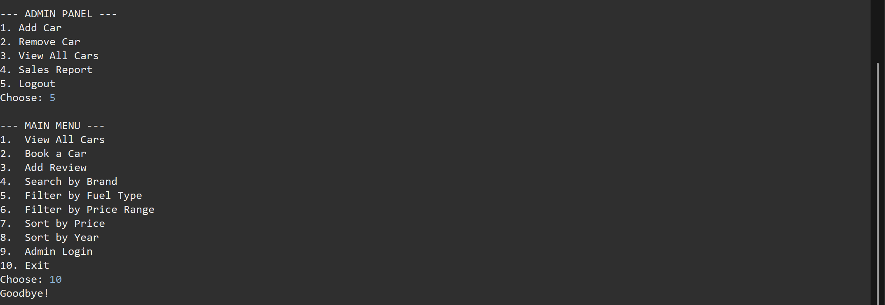
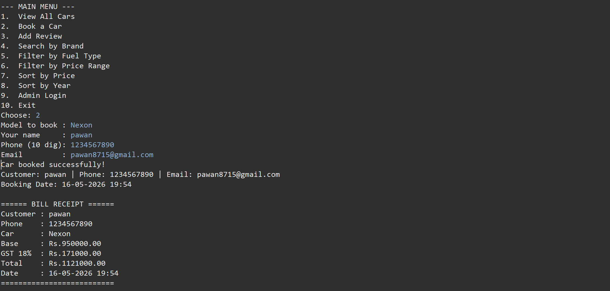
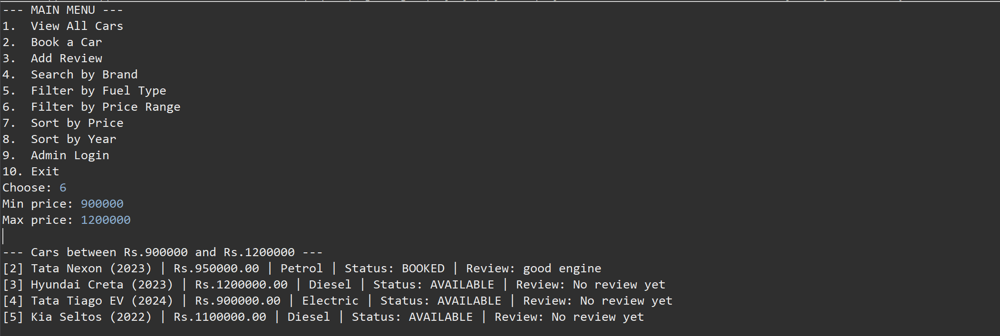
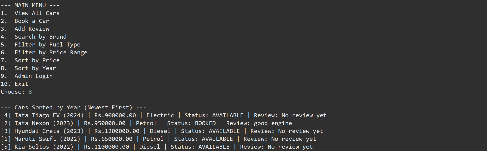
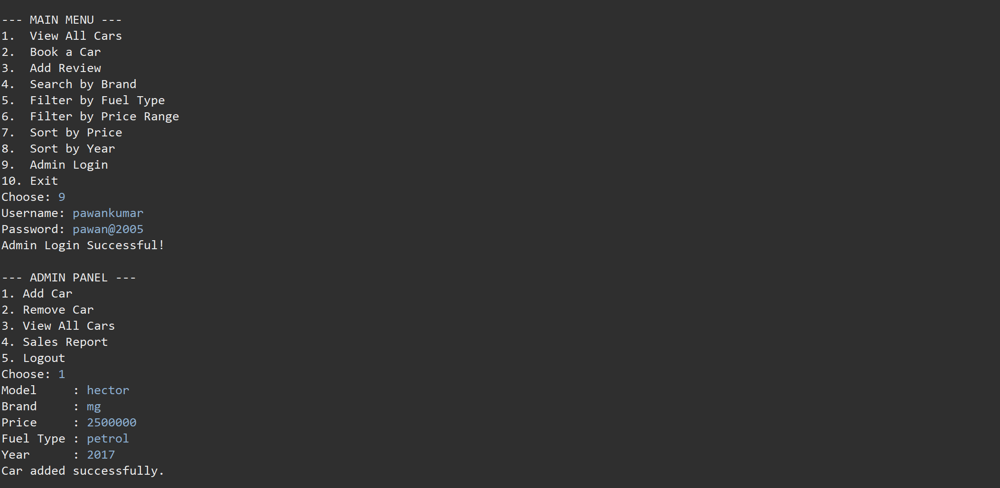
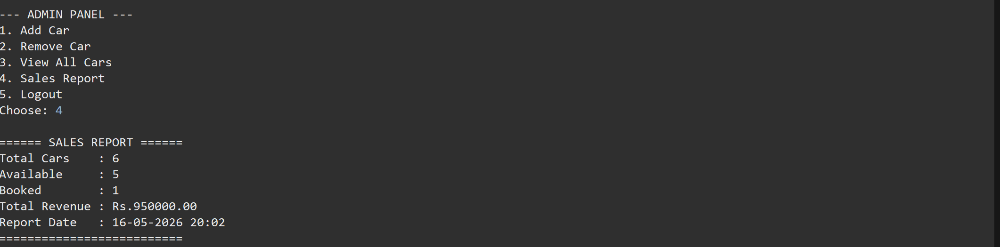

# Car Store Management System

A Java-based full-stack Car Store Management System with MySQL database integration.

---

## Features

- View, Add, Remove cars (Admin)
- Book a car with customer details and auto-generated bill (with GST)
- Search cars by brand
- Filter by fuel type (Petrol / Diesel / Electric)
- Filter by price range
- Sort by price (low to high)
- Sort by year (newest first)
- Add and view car reviews
- Role-based Admin panel with authentication
- Sales report with total revenue
- Input validation and exception handling throughout
- Date & time stamped bookings

---

## Tech Stack

Java | MySQL | JDBC | OOP | Collections | Exception Handling | Streams | Enum

---

## OOP Concepts Used

- Classes & Objects (Car, Customer)
- Encapsulation (private fields, getters/setters)
- Abstraction (DatabaseConnection)
- Enum (CarStatus: AVAILABLE, BOOKED, SOLD)
- Exception Handling (try/catch/throw)

---

## How to Run

1. Import `carstore_db.sql` into MySQL
2. Update `DatabaseConnection.java` with your local MySQL password
3. Open project in Eclipse or IntelliJ
4. Run `carstoreapp.java`

---

## Database Setup

```sql
mysql -u root -p < carstore_db.sql
```

---

## Screenshots

### Main Menu


### Car Booking and Bill Receipt


### Filter by Price Range


### Sort Cars by Year


### Admin Add Car


### Sales Report


---

## Author

**Bairi Pawan Kumar** — Learning Java & Backend Development

- LinkedIn: [https://linkedin.com/in/YOUR-LINK](https://www.linkedin.com/in/bairi-paawan-kumar-26bb4628b/)
- GitHub: [https://github.com/YOUR-USERNAME](https://github.com/PAWAN0836)

---

## License

MIT — free to use, learn, and modify.
